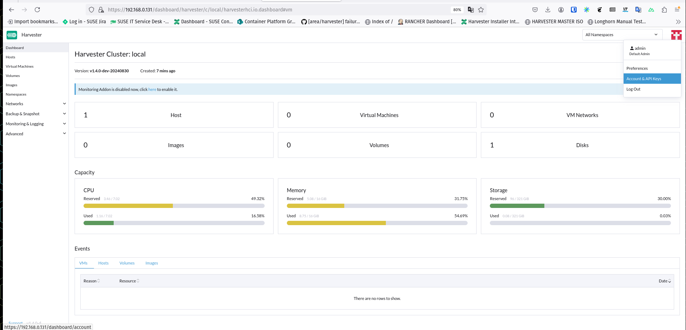
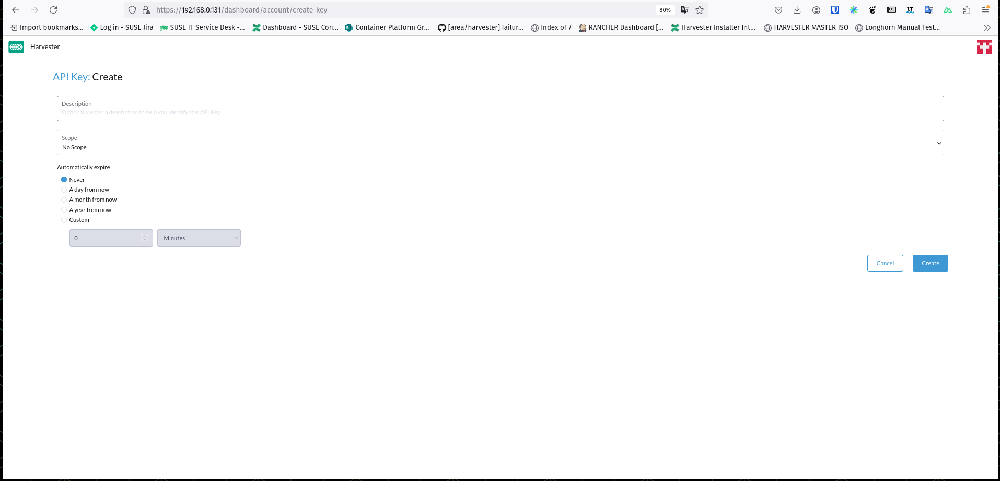
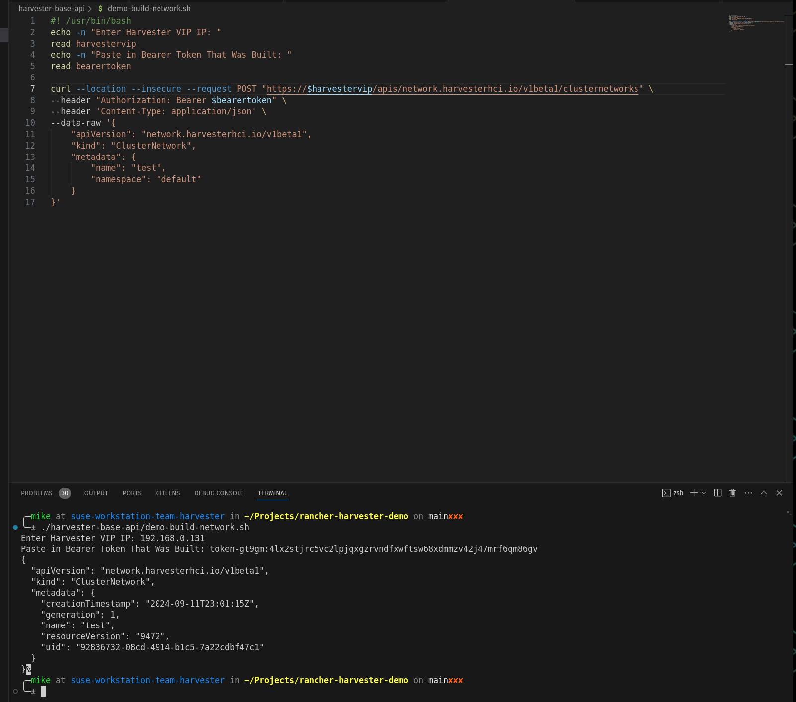
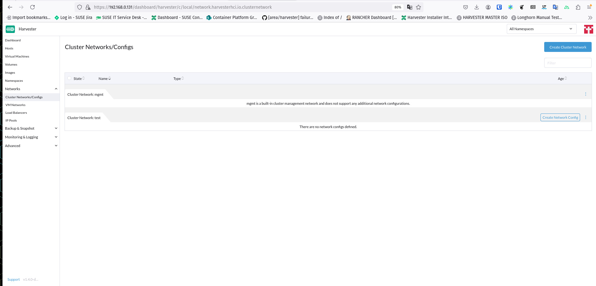

### Example:
- https://docs.harvesterhci.io/v1.3/api/create-namespaced-cluster-network


### Example Bearer:
```
token-gt9gm:4lx2stjrc5vc2lpjqxgzrvndfxwftsw68xdmmzv42j47mrf6qm86gv
```

### Support Images Examples:












### VMs are KubeVirt Based:
- https://kubevirt.io/api-reference/master/definitions.html#_v1_virtualmachineinstancespec
- https://docs.harvesterhci.io/v1.4/api/create-namespaced-virtual-machine


## General

In general, raw api calls might not be the preferred method to building resources on Harvester.
We generally have a better set of tools with:
- [Harvester Provider Terraform (strongly encouraged to use)](https://github.com/harvester/terraform-provider-harvester)
- [community based, "harvester-cli" (unsupported)](https://github.com/belgaied2/harvester-cli)

**The most important mention is that Harvester is generally a wrapper around KubeVirt -> so the VirtualMachineSpec is best shown through KubeVirtDocs**:
- https://kubevirt.io/api-reference/master/definitions.html#_v1_virtualmachine

Additionally, to get a better **gist** of how to an extent this is done is to take a peek at @starbops [starbops](https://github.com/starbops) awesome doc that demos a guide of a ["Poor Man's Harvester"](https://blog.zespre.com/poor-mans-harvester/).


There are some generalized simple examples here.

But some more of the key flows / scenarios are as follows.

Scenario 1:
- we have just a VM in the simpliest fashion built with a "container-disk" based setup, where it's just going to pull the image and run the container as a given VM, in this instance we use Fedora Live from KubeVirt's example (fedora/fedora) for the login -> "demo-build-vm.sh"

Scenario 2:
- we have just a generalized x86_64 cloud image (could be ubuntu, opensuse, fedora, etc.)(in this usecase just using `cirros`, which won't really leverage the cloud-init-disk), we download that via an api call demo-build-vm-image.sh
- then after it's downloaded we utilize it's "name" as the "id" and we build what will be our "rootdisk" for the VM, this again is a separate API call, building a volume, "demo-build-volume-rootdisk.sh"
- then after that rootdisk is built, we tie it into the `harvesterhci.io/volumeClaimTemplates` annotation in the VM creation as well as the volume + disks, "demo-build-vm-with-cirros-rootdisk.sh"


## Additional General

- Please take a look at the abstracted content in [harvester/tests/apiclient/harvester_api](https://github.com/harvester/tests/tree/main/apiclient) as to how some of these calls are crafted / look for more programmatic approach
- additionally the [Harvester APIs Docs](https://docs.harvesterhci.io/v1.3/api/harvester-apis)