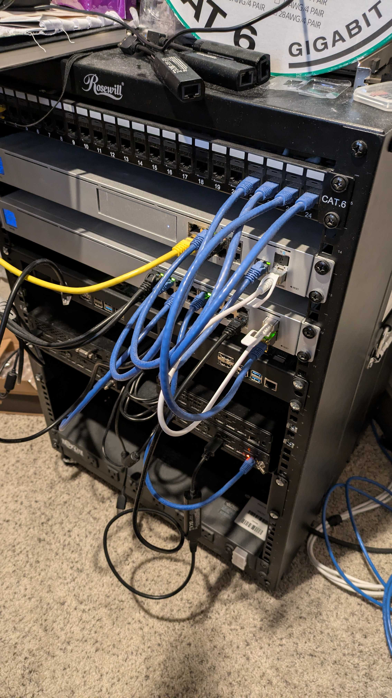
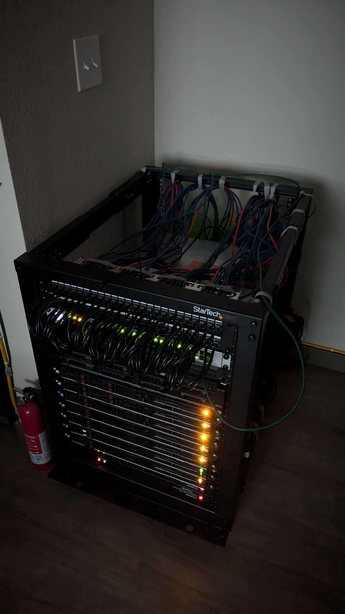

### Small Example

just a small sample of leveraging a Harvester configuration from a localized fileserver that's injected into a pxe boot interactive based install -> providing a Harvester cluster install finished (interactively) in ~13 min.

Media folder holds .mp4, for viewing w/ bare-metal

## Additional Context:

The NetBootXYZ system has been set up [netbootxyz](https://technotim.live/posts/netbootxyz-tutorial/):
    - you can additionally check out my [netboot.xyz-custom ipxe menu I built for a fileserver based install of harvester interactively](https://github.com/irishgordo/netboot.xyz-custom/tree/master)
    - `netboot.xyz` out of the box does like the Harvester project and has provided some layer of support for it: https://github.com/netbootxyz/netboot.xyz/blob/development/roles/netbootxyz/templates/menu/harvester.ipxe.j2

This is done at the Switch/Router level, to provide iPXE/PXE Booting for Legacy BIOS based servers.
For instance I have 8 HP DL 160s + 1 Dell PowerEdge R720, which are all just infrastructure leveraged for open-source work, it really has no purpose besides that :)
Additionally Unifi/Ubiquiti system (version 8 controller) to provide a 1GB~ish all around backbone over CAT6 in my super tiny apartment :)

Also to mention, the same setups, of resource object yamls, can be leveraged with something like Fleet.

Please take a look at this Fleet demo for deeper automation tooling:
- https://github.com/ibrokethecloud/harvester-fleet-demo/