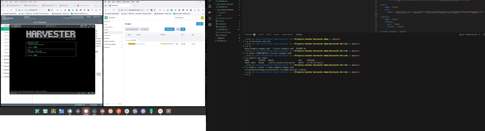

### Example
Basic object creation of a minimal image

Could be leveraged as well with something like Rancher Fleet + "harvester_baremetal_workload" (w/ Rancher), x-ref:
- github.com/harvester/harvester/issues/5820
- github.com/ibrokethecloud/harvester-fleet-demo/

### Sample

For instance creating a vm image just pure spec definition:

